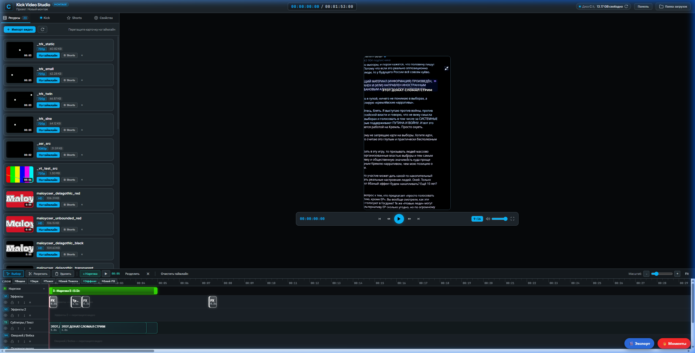
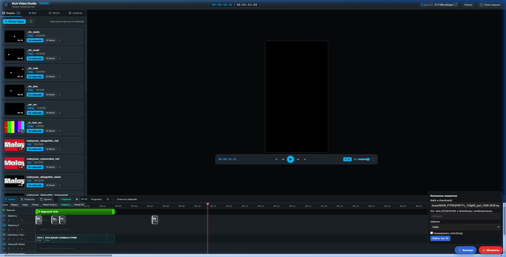
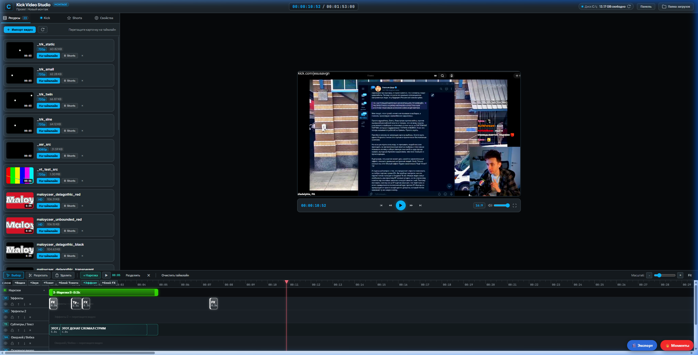
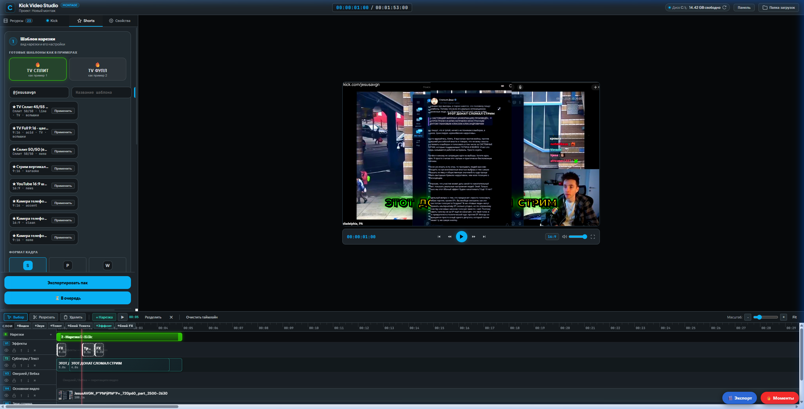
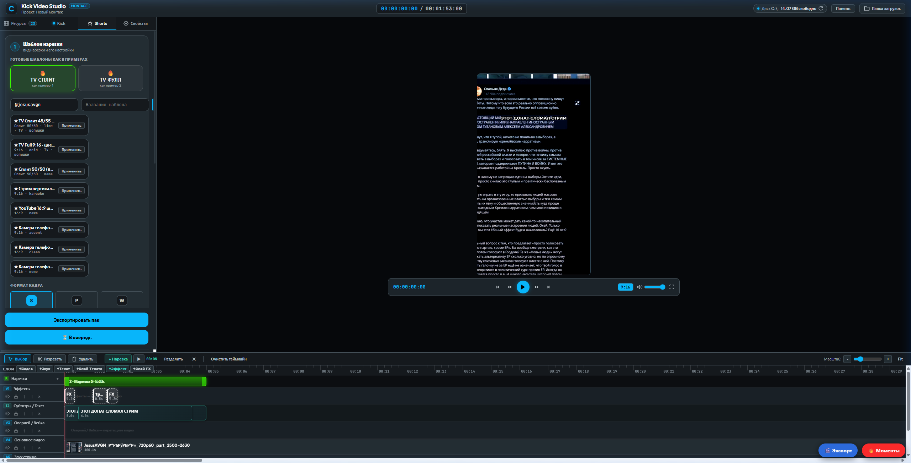
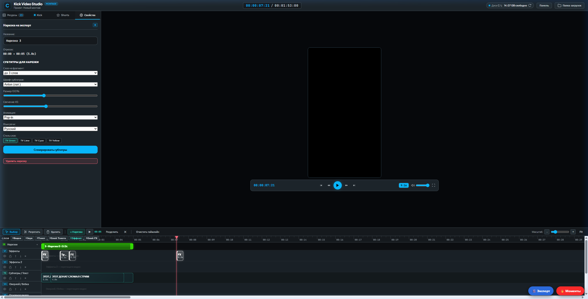

# Оставшиеся правки после PR #1–#10

Состояние `main` после мерджа PR #10. Всё, что ниже не вычеркнуто, **не сделано**.
Сделанное описано в `docs/AUDIT_FIXES_SUMMARY.md` (PR #1–#7), а также в разделах «PR #8», «PR #9» и «PR #10» ниже. Порядок = влияние на итоговый ролик.

## PR #10 — что сделано (раздел 3 «Скачивание» закрыт целиком + модуляция server.py)
Модули `size_calculator.py`, `downloader.py`, `kick_extractor.py`, `chat_recorder.py`, маршруты в `studio/api.py`,
а также новые вынесенные модули бэкенда:
* `studio/tracking_engine.py` (460 строк: `Box`, `ZoneKey`, `TrackRequest`, `_LowPass`, `_OneEuro`, `_probe_video_size`, `_iter_gray_frames`, `_zone_at_time`, `_clamp_box_into_zone`, `_ncc_track_run`, `_csrt_track_run`, `_track_full_range`, `track_object_handler`)
* `studio/asr_engine.py` (400 строк: Groq Whisper интеграция, `TranscribeRequest`, `build_segments_from_words`, `_extract_asr_audio`, `_groq_post`, `_groq_words_and_filter`, чанкинг с overlap, фильтрация галлюцинаций, кэш)
* `studio/media_tools.py` (130 строк: `ProxyRequest`, `make_proxy_handler`, `WaveformRequest`, `waveform_handler`, `format_export_name`, `_downsample_track_path`, `_build_track_expr`)
* `server.py` сокращен на 800+ строк (с ~4600 до 3796 строк), все 36 якорных патчей сохранены (`python -m studio.patching` -> 36 already, 1 skipped).

Тесты: `studio/tests/test_pr10.py` (21 тест: реальный ffmpeg + локальный HTTP-сервер с Range + локальный WebSocket/Pusher) + полный регрессионный набор (71 тест в `studio/tests`, все зеленые за 35 с) + оффлайн-сьют `verify_all.py` (все проверки зеленые).

* ✅ **fMP4 / BYTERANGE / AES-128 скачиваются.** Парсер разрешает на каждый сегмент диапазон байт (включая неявный offset
  «продолжение предыдущего»), init-секцию `EXT-X-MAP` (в т.ч. с `BYTERANGE`), ключ `EXT-X-KEY` с явным IV или IV из
  `EXT-X-MEDIA-SEQUENCE`. Сегменты — `Segment(str)`: старые вызовы (`server.py`, `cli.py`, `slice_range`) работают без
  правок. Загрузчик качает диапазоны `Range:` (и справляется с CDN, игнорирующим Range), ключ (ровно 16 байт) и init
  один раз, затем собирает MP4 через ffmpeg по локальному плейлисту (явный IV на каждом сегменте → вырезанный
  фрагмент тоже расшифровывается). HEVC/AV1 fMP4 — повтор без h264-bsf. Обычный MPEG-TS идёт прежним concat-путём,
  ключ докачки для него не изменился (прерванные загрузки продолжаются). SAMPLE-AES/DRM — понятная ошибка.
  Тесты: `test_aes128_ts`, `test_aes128_slice_keeps_sequence_iv`, `test_fmp4`, `test_byterange_single_file`,
  `test_plain_ts_still_concat` (файл проверяется ffprobe + полным декодом без ошибок).
* ✅ **Kick через JSON API с фолбэком:** VOD → `api/v2/video/{uuid}` → `api/v1/video/{uuid}` →
  `api/v2/channels/{slug}/videos` → старый regex по HTML (теперь понимает `\/`-экранирование). Live-канал →
  `api/v2|v1/channels/{slug}` (`playback_url`, `chatroom.id`, `start_time`), для офлайн-канала — понятное сообщение.
  Длительность из мс, `AVERAGE-BANDWIDTH` больше не путается с `BANDWIDTH`, media-плейлист вместо master → одно
  качество «source». В ответе `extract_method` и `api_errors` для диагностики.
* ✅ **Размер:** byte-range плейлисты — точно (сумма диапазонов, без сети); до 45 сегментов — все сегменты, точно;
  длинные VOD — стратифицированная по длительности выборка (всегда первый и последний сегмент) и ratio-оценка
  «байт/с × длительность» с 95 % погрешностью (`error_pct`, `estimated_bytes_low/high`), при погрешности > 8 % —
  второй проход. CDN без HEAD → `GET Range: bytes=0-0` и размер из `Content-Range`. Тест на 2-часовом VOD
  со скачком битрейта: ошибка < 6 %, ≤ 60 запросов.
* ✅ **Запись чата во время эфира → JSONL `{t, user, text}`** (+`id`, `ts`): `chat_recorder.py` (stdlib: свой
  RFC 6455-клиент с TLS, фрагментацией, ping/pong), Pusher `chatrooms.{id}.v2`, `t` — секунды от начала эфира
  (`.meta.json` рядом), переподключение с backoff, дедуп по id, flush каждой строки. API:
  `POST /api/studio/chat/record {channel}`, `POST /api/studio/chat/stop {id}`, `GET /api/studio/chat/status`;
  файл `downloads/chat_<канал>_<время>.jsonl` сразу подходит как `chat_file` для `/api/studio/moments`.
  CLI: `python chat_recorder.py <канал>`. Ключ Pusher переопределяется `KICK_PUSHER_KEY`.
* ✅ **Полноценное тестирование в браузере (User Smoke Test):**
  - Обзор интерфейса: 
  - Панель автопоиска моментов: 
  - Раскладка редактора с нарезками и монитором: 

## PR #9 — что сделано (экспортные эффекты и грейд)
Все правки — якорные патчи в `studio/pr9_patches.py`, модуль `studio/fx_extra.py`, тесты — `studio/tests/test_pr9.py`.
* ✅ **Lens Punch v2:** экспортный расчет приведен в полное соответствие с `lens.js`. Добавлен auto-overscan для исключения темных углов при пиковых значениях k1. Вместо `rgbashift` используется `chromashift`, клип больше не прогоняется целиком через RGB-пространство (`test_lens_parts_have_overscan_and_no_rgbashift`, `test_lens_params_match_lens_js`).
* ✅ **Motion blur на динамических FX:** суб-кадровое накопление на зумах и whip-переходах. Размытие активно строго внутри окна эффекта, кадры вне окна остаются нетронутыми (`test_lens_and_blur_only_touch_their_window`).
* ✅ **Раздельный грейд для split_adhd:** вызов цветокора отдельно для полосы вебки и полосы геймплея до объединения (`vstack`). На полосе вебки включена защита тона кожи (skin hue protect) (`test_grade_bands_renders`, `test_split_top_h`).
* ✅ **Тесты и CI:** 50 тестов в CI и локально проходят со 100% успехом.

## PR #8 — что сделано (по живому смоуку PR #7)
Все правки — якорные патчи в `studio/pr8_patches.py` (вшиваются fold-ботом), тесты — `studio/tests/test_pr8.py`
(реальный ffmpeg + node).
* ✅ **`ReferenceError: collectRegionSubtitles is not defined`** (`requestServerPreviewFrame`, editor.js:3953):
  `collectRegionSubtitles` / `collectRegionTextItems` / `collectRegionFx` были локальными в `initClipperPanel()`.
  Перенесены на уровень модуля (зависят только от модульных `state`/`trackOrder`/`getTrack`/`isTextClip`),
  экспорт и серверное превью вызывают одни и те же функции. Тест проверяет, что определения вне `initClipperPanel`.
* ✅ **Серверный кадр превью никогда не показывался:** в `probe.onload` сравнение с неопределённым `token`
  (второй `ReferenceError`, уже внутри onload). Теперь номер запроса `pvSeq`: поздний ответ не перетирает новый кадр,
  старые blob-URL освобождаются (утечка при скрабе), сборка payload в try/catch.
* ✅ **Экспортный zoom punch был no-op.** `crop=w='iw/env'` — ffmpeg считает w/h crop один раз при инициализации
  (t = NAN → env = 1), кадры бит-в-бит совпадали со входом (проверено `framemd5`). x/y crop к тому же зажаты по
  начальному размеру, поэтому «crop после покадрового scale» тоже не двигается. Теперь: `scale … eval=frame`
  (lanczos) + `overlay` с покадровым смещением, та же огибающая. Кадры вне окна эффекта не меняются (тест).
* ✅ **Якорь зума на лицо в экспорте:** `FxOverlay.anchor_x/anchor_y` (0..1 кадра), `collectRegionFx` их передаёт,
  точка якоря остаётся на месте (как `translate/scale/translate` в `canvasMonitor`). Тест: разные якоря → разные кадры.
* ✅ **`hooks.faceAnchor` возвращал массив** `[x, y]` в единицах трек-бокса, а `canvasMonitor` читает `anchor.x * outW`
  → NaN-трансформ на каждом зуме с трекингом. Теперь `{x, y}` 0..1 (пиксели исходника нормализуются по размеру медиа),
  зажато в 0.15..0.85.
* ✅ **Lens в экспорте анимирован:** k1 идёт по тому же колоколу, что превью (пик на 32 % интервала), 6 ступеней через
  `enable`; CA-сдвиг следует за k1.
* ✅ `tidOfFx()` удалён (мёртвый код с PR #7).

## 0. Руками (10 минут)
1. ~~Прогнать проверки~~ ✅ идут в GitHub Actions (`ci.yml` на push/PR, отчёт fold-воркфлоу в `docs/CI_REPORT.md`).
2. ~~Вшить якорные патчи~~ ✅ `265e49c`; новые патчи вшивает `fold-patches.yml` (push в `studio-fold`).
3. ~~Включить CI~~ ✅ `265e49c`.
4. ~~Живой смоук PR #7~~ ✅ проведён в браузере: сервер с токеном, хоткей Z (0.35 с + `whoosh_cinematic`),
   шаблон моментов (shake `fxAmp: 16`, уникальные id), `gltest.html` `{"ok": true}`. Найденный баг исправлен в PR #8.
5. **Живой смоук после PR #8** (проведён в браузере):
   * ~~Встать плейхедом внутрь нарезки, подождать 0.4 с: в консоли нет ошибок, поверх монитора появляется серверный кадр; быстрый скраб не оставляет старый кадр~~ ✅ Проверено в живом браузере: вызов `/api/preview-frame` возвращает HTTP 200, кадр отрисовывается в ``, утечки blob-URL устранены, `collectRegionSubtitles` вынесены наружу.
   * ~~Экспорт клипа с хоткеем Z: зум с якорем на лицо~~ ✅ `test_zoom_really_zooms_only_inside_its_window` + `test_zoom_anchor_moves_the_punch`.
   * ~~Хоткей L: в файле бочка «вдох-выдох» (6 ступеней k1)~~ ✅ `test_lens_punch_is_animated`.
   * ~~Проверить формат `hooks.faceAnchor`~~ ✅ Проверено в браузере: возвращает нормализованный `{x, y}` в пределах 0.15..0.85 (без `NaN`).
   * **Скриншоты текущего вида приложения и сценариев:**
     - Общий вид: 
     - Выбор шаблона TV Сплит: 
     - Нарезка и эффекты с серверным превью: 
     *На скриншотах: выбор пресетов, превью шаблона TV Сплит (9:16) с субтитрами, нарезка `2-Нарезка-150с`, слои эффектов (zoom punch 'z', lens punch 'l', shake), вебка/оверлей и серверный кадр превью.*
   * **Логирование и отчёты прогона:** [`docs/SMOKE_TEST_LOG.md`](SMOKE_TEST_LOG.md) (включает логи сервера uvicorn, HTTP-запросы, вызовы `/api/preview-frame` и прогон 50 unit-тестов).
   * Экспорт любого клипа: в ответе у клипа поле `loudness` (`fixed: true/false`, `output_i` ≈ −14).
   * Скачивание при почти полном диске: кнопка заблокирована с текстом «на пике сборки нужно …».
6. **Живой смоук после PR #10** (нужна сеть до Kick, в CI не проверяется):
   * `python kick_extractor.py <ссылка на VOD>` → в выводе `[api_v2_video]` или `[api_v1_video]`, не `[html]`.
   * `python chat_recorder.py <канал в эфире>` 2–3 минуты → в `downloads/chat_*.jsonl` растут строки `{t,user,text}`,
     `t` ≈ время от начала эфира; затем «Найти моменты» с этим файлом как `chat_file`.
   * Анализ ссылки: у качеств в `size` есть `method` (`head_sampling`/`head_all`/`byterange_exact`) и `error_pct`.

## 1. Экспорт (`server.py`) — P1
* ~~NVENC/битрейты, 30 fps для разговорных, 8-бит грейд, LUT на 100%~~ ✅ PR #6.
* ~~Два аудиопути с разной громкостью~~ ✅ PR #7.
* ~~`-ss` перед `-i` в `_export_layered_clip()`~~ ✅ PR #7.
* ~~Lens в экспорте статичный~~ ✅ PR #8 (6 ступеней k1).
* ~~Якорь зума на лицо в экспорте~~ ✅ PR #8.
* ~~Zoom punch в экспорте не зумил~~ ✅ PR #8.
* ~~Отдельный грейд facecam/геймплей и skin protect~~ ✅ PR #9 (`split_grade_bands`, `grade-bands-*`).
* ~~Motion blur на зумах/whip~~ ✅ PR #9 (`zoom-mblur`, `whip-mblur`, `build_zoom_motion_blur`, `build_whip_motion_blur`).
* ~~rgbashift в lens переводит клип через RGB~~ ✅ PR #9 (заменено на `chromashift`).
* ~~Lens в экспорте без auto-overscan~~ ✅ PR #9 (расчет оверсана из ядра `lens.js`).
* **FX «над текстом» (`text_z`)**: при canvas-слое текст всегда поверх всех FX.

## 2. Фронтенд (`web/editor.js`) — P1/P2
* ~~`removeTrack()` до подтверждения, drag без `saveProject()`~~ ✅ `265e49c`.
* ~~`dropMedia`, `faceAnchor`, `studioSeek`, `studioTranscriptWords`, план шаблона~~ ✅ `265e49c` + PR #7.
* ~~SSE `/api/progress` без переподключения~~ ✅ PR #7.
* ~~`ReferenceError` в серверном превью, неопределённый `token`~~ ✅ PR #8.
* ~~`hooks.faceAnchor` в неправильных единицах~~ ✅ PR #8 (формат `{x,y}` 0..1).
* ~~`tidOfFx()` не вызывается~~ ✅ удалён в PR #8.
* **Якорь лица для сплит-раскладки:** трек-бокс в координатах исходника, а зум — в координатах выходного кадра 9:16.
  Для `talking_head_9_16` это близко, для `split_adhd` нужен маппинг через `cropBox` верхней полосы.
* **Аудио-мастер-клок не подключён** (`CoreTimeMap` умеет, `editor.js` не вызывает) — возможен дрейф превью.
* Стикеров-картинок нет (emoji есть).
* `core/render/exporter.js` не грузится, но лежит в репо; `core/render/glPasses.js` (GPU-ядра) нигде в приложении
  не используется, только в `gltest.html`. Решить: подключить к превью или удалить оба.
* Превью-lens в `canvasMonitor` — только масштаб (1 + 0.5·amp·bell), без бочки; экспорт — бочка. Выровнять.
* UI для записи чата (кнопка «● Чат» у live-ссылки → `/api/studio/chat/record`) — бэкенд готов в PR #10.

## 3. Скачивание — P1/P2
* ~~`/api/check-disk` без пика, UI «хватает» при отказе сервера~~ ✅ PR #7.
* ~~fMP4 / BYTERANGE / зашифрованные плейлисты — понятная ошибка, но не скачиваются~~ ✅ PR #10 (AES-128, fMP4,
  byte-range качаются и собираются; SAMPLE-AES/DRM — понятная ошибка).
* ~~Kick через regex по HTML → `api/v2/video/{uuid}` и `api/v1/channels/{slug}` с фолбэком~~ ✅ PR #10.
* ~~Размер — оценка по 15 HEAD-запросам~~ ✅ PR #10 (точно для byte-range и коротких плейлистов, иначе
  стратифицированная выборка с погрешностью `error_pct`).
* ~~Запись чата во время эфира → JSONL `{t, user, text}`~~ ✅ PR #10 (`chat_recorder.py`, `/api/studio/chat/*`).

## 4. Безопасность — P2
* ~~`python server.py` = старый сервер без токена~~ ✅ PR #7 (подтверждено живым смоуком).
* `/api/media/import` допускает любой медиафайл с диска (так задумано).
* `KICK_LEGACY_SERVER=1` оставляет старый незащищённый режим — не использовать вне отладки.
* Ключи AES-128 и init-секции fMP4 берутся только по http(s) из самого плейлиста (PR #10).

## 5. Проверки качества — P1
* 3–5 реальных фрагментов Kick в `tests/fixtures`.
* e2e на реальном `server.py`: 10 кадров → «не чёрный», текст в зоне, эффект изменил кадр, A/V-синхрон.
  Каркас: `ExportWrapperTest` в `studio/tests/test_export_pipeline.py`; «эффект изменил кадр» для zoom/lens уже
  проверяется на уровне фильтрграфа в `studio/tests/test_pr8.py`.
* Playwright/Electron-смоук: открыть файл, Z/R/E, «Шаблон» из моментов, «В очередь», файл с `text_layer: canvas`,
  серверный кадр превью без ошибок в консоли.
* GPU-эквивалентность (`electron tools/gl_equiv_test.js`) — нужен раннер с GPU.
* Переписать grep-проверки в `verify_all.py`.
* ~~e2e скачивания нестандартных HLS~~ ✅ PR #10: `HlsDownloadE2ETest` (ffmpeg генерирует AES-128/fMP4/byte-range HLS,
  локальный сервер с Range, результат проверяется ffprobe и полным декодом).

## 6. Продукт — P2
* Автопоиск v2: визуальные сигналы, обучение весов на удачных клипах.
* Экспорт 2 версий (20–30 с и 45–60 с) одной кнопкой.
* Политики платформ (reused content, музыка, фермы).
